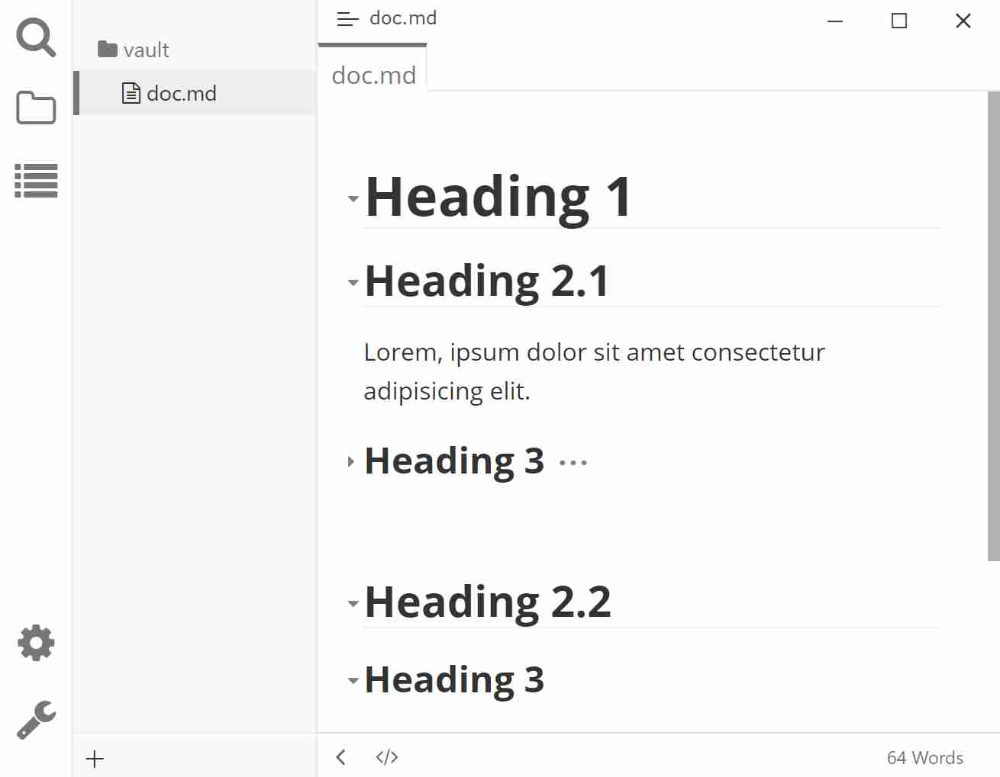
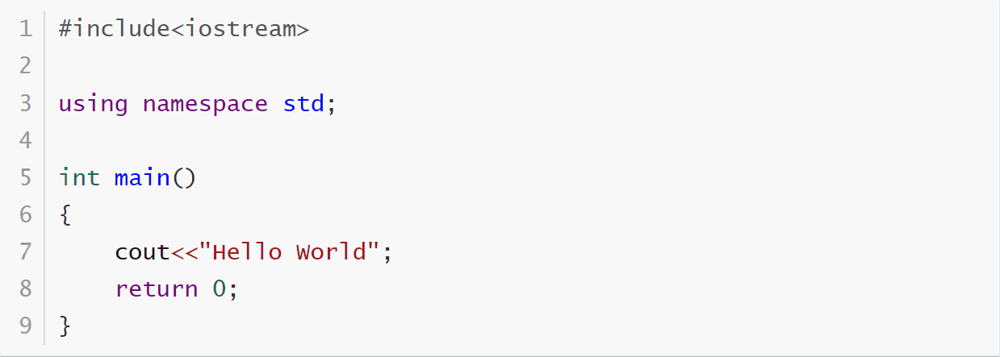

# Typora Plugin Collapsible Section

English | [简体中文](./README.zh-CN.md)

This a plugin based on [typora-community-plugin][core] for [Typora](https://typora.io).

Fold/unfold markdown section:

- [x] Heading
- [x] Nested list
- [x] Codeblock
- [x] Table

## Preview

## Install

1. Install [typora-community-plugin][core]
2. Open "Settings -> Plugin Marketplace" search "Collapsible Section" then install it.

[core]: https://github.com/typora-community-plugin/typora-community-plugin
