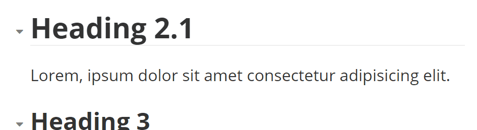
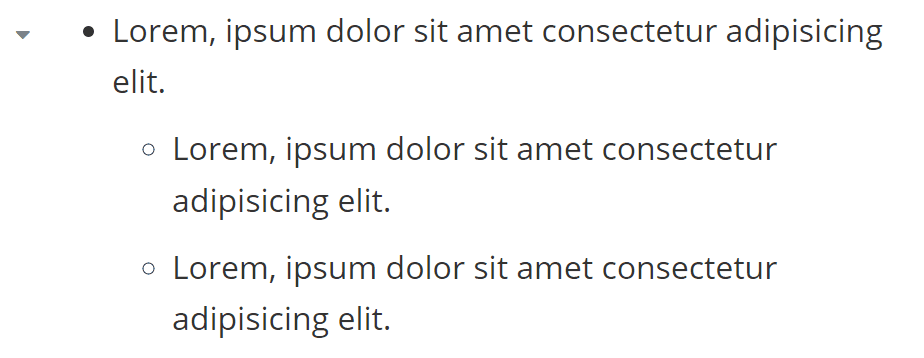
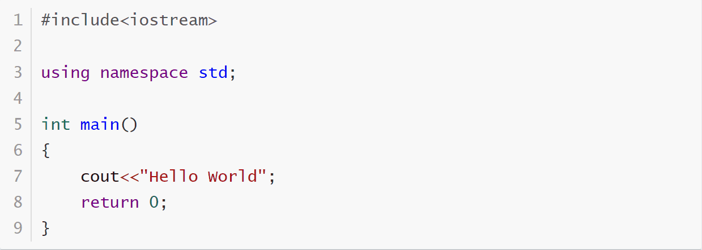
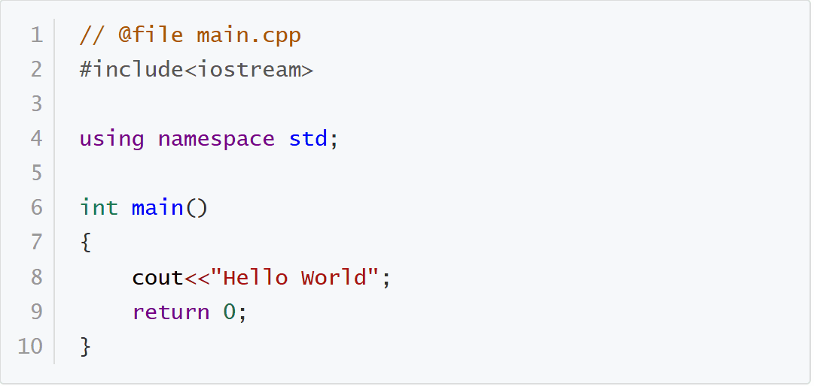
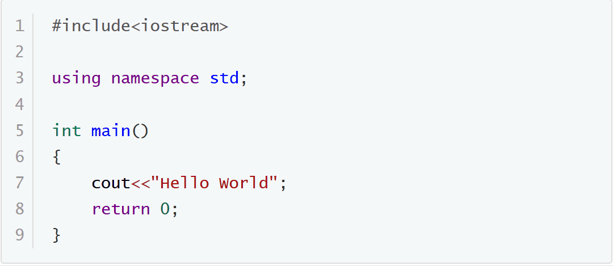
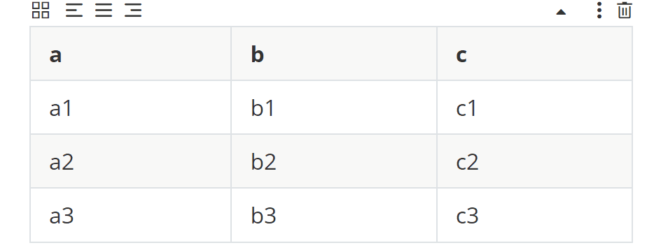
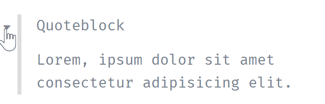
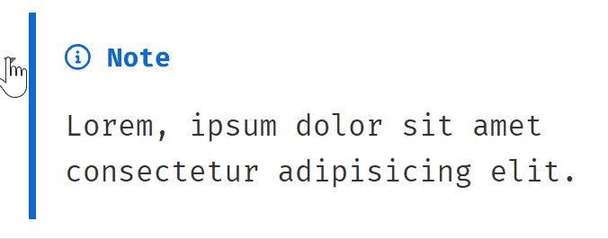

# Typora Plugin Collapsible Section

[English](./README.md) | 简体中文

这是一个基于 [typora-community-plugin][core] 开发的，适用于 [Typora](https://typora.io) 的插件。

折叠/展开 Markdown 章节:

- [x] 根据标题折叠
- [x] 嵌套列表折叠
- [x] 代码块折叠
- [x] 表格折叠
- [x] 引用块折叠
  - [x] 标注块（Callout）折叠

## 预览

| **折叠标题**                         | **折叠列表**                                  |
| :----------------------------------: | :------------------------------------------: |
|       |                   |
| **折叠代码块 (mode=fold,style=lang)** | **折叠代码块 (mode=fold,style=first_line)**   |
|      |             |
| **折叠代码块 (mode=limit_height)**    | **折叠表格**                                 |
|     |                  |
| **引用块**                            | **标注块（Callout）**                        |
|     |                |

## 设置

- **全局开关**：通过单一复选框一键启用或禁用所有可折叠区域功能。
- **Glob 表达式限定文件范围**：使用 Glob 表达式（例如 `docs/**/*.md`）限制插件生效的文件范围。支持通配符（`*`、`**`、`?`）、字符集（`[abc]`）和多选一（`{a,b}`）。留空表示对所有文件生效。
- **FrontMatter 逐文件控制**：通过 YAML FrontMatter 中的 `collapsableSections` 和 `uncollapsableSections` 键，在逐文件级别启用或禁用特定类型的折叠区域（"h1" | "h2" | "h3" | "h4" | "h5" | "h6" | "list" | "codeblock" | "table" | "plain_quote_block" | "callout"）。如：
  ```yaml
  collapsableSections: [h1, h2, h3]
  ```
  或者
  ```yaml
  uncollapsableSections:
  - h4
  - h5
  - h6
  ```

## 安装

1. 安装 [typora-community-plugin][core]
2. 在 “设置 -> 插件市场” 中搜索 “Collapsible Section” 并安装


[core]: https://github.com/typora-community-plugin/typora-community-plugin
