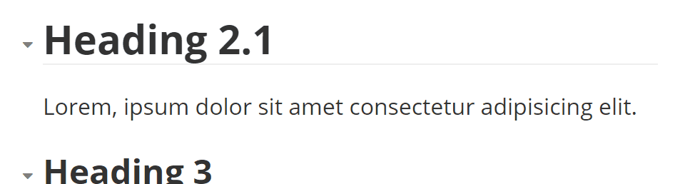
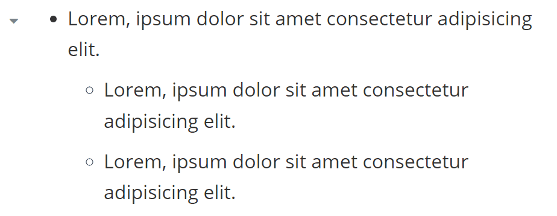
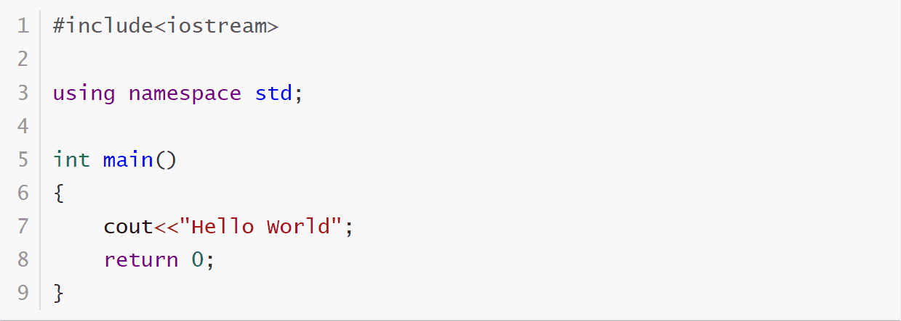

# Typora Plugin Collapsible Section

[English](./README.md) | 简体中文

这是一个基于 [typora-community-plugin][core] 开发的，适用于 [Typora](https://typora.io) 的插件。

折叠/展开 Markdown 章节:

- [x] 根据标题折叠
- [x] 嵌套列表折叠
- [x] 代码块折叠
- [x] 表格折叠

## 预览

| **折叠标题**                      | **折叠列表**                   |
| :------------------------------: | :--------------------------: |
|   |   |
| **折叠代码块**                     | **折叠表格**                   |
|  |  |

## 安装

1. 安装 [typora-community-plugin][core]
2. 在 “设置 -> 插件市场” 中搜索 “Collapsible Section” 并安装

[core]: https://github.com/typora-community-plugin/typora-community-plugin
